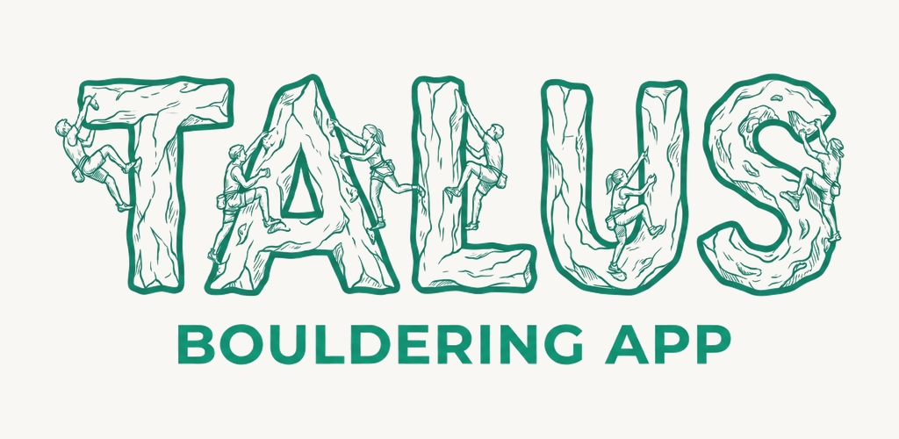
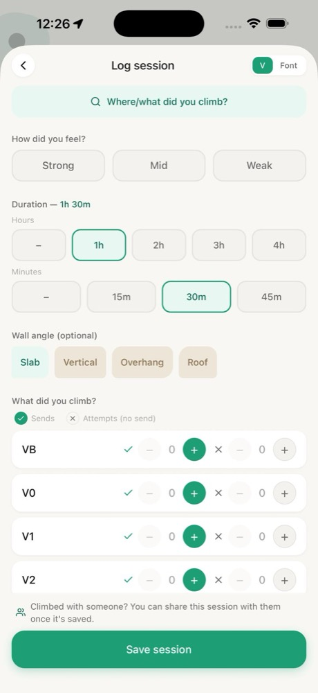
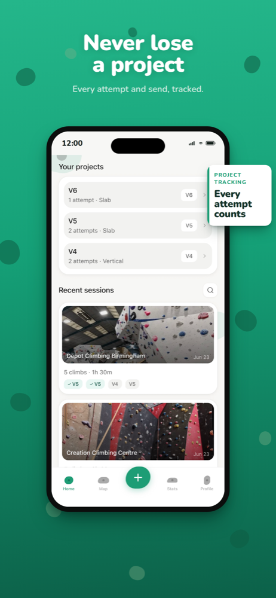
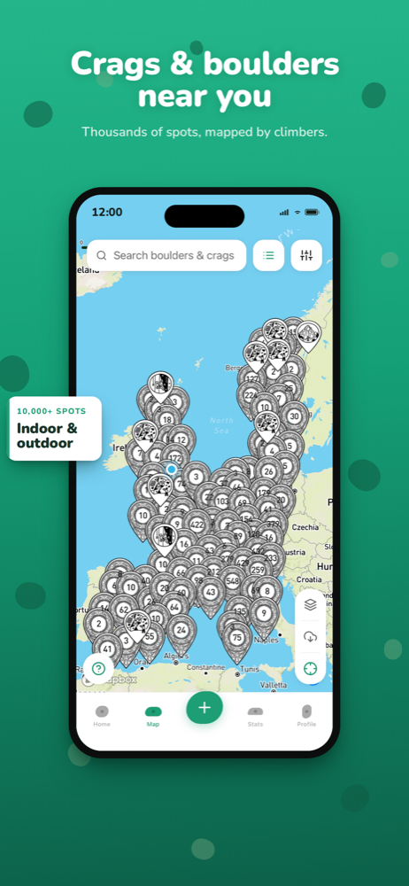
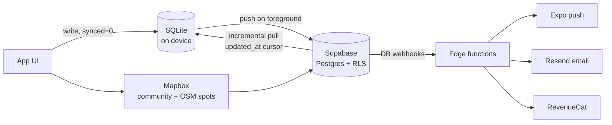

# Talus: bouldering log

> An offline-first bouldering tracker for climbers who log at the crag with cold hands and no signal, with a coach that tells you what to work on next.

> [!NOTE]
> Talus is a live product, so the source is private. This repo explains what it does and how it's built.

  
  
  

## What it does

- **Log a session in seconds.** Tap sends and attempts per grade, grouped by wall angle, with an optional per-climb detail view. Logging makes no network calls, so it works at the crag and syncs later.
- **Stats that mean something.** Grade pyramid, send rate, volume, top grade, training load and a grade forecast, over 7 days up to all time.
- **A coach.** It gives a weekly focus, a briefing and a session plan that names real grades and problem counts, scaled to how you actually climb.
- **Community map.** Over 10,000 crags, boulders and gyms (OpenStreetMap plus climber-added spots), with photos, ratings, beta videos, wishlists, moderation and offline map packs.
- **Climb together.** Share a session through an expiring link, and your partner claims it into their own log.
- **Your data stays yours.** Import from theCrag or Mountain Project, export to CSV or JSON, and delete your account in-app.

## The coach: statistics, not an LLM

The coach is entirely rule-based TypeScript, and that's deliberate. Climbers trust advice they can check, so every claim has to survive its own sample size.

- **Send rate is an interval, not a number.** The log stores failed tries in buckets, so the true rate sits within a range. Comparisons widen that with Wilson intervals.
- **Claims gate themselves.** "Overhang is your weakness" only appears if the two intervals don't overlap, so small samples quietly suppress themselves. Each kind of claim has its own evidence floor.
- **One rule wins per week.** A fixed priority order (rest, ease back in, weak angle, weak hold type, consolidate, push a grade, consistency, maintain) means the advice never contradicts itself.
- **Benchmarked against real climbers.** The main diagnostic, the gap between your max and flash grade, is compared with published norms from about 88,000 climbers.
- **Rebuilt when it was wrong.** The first training-load model told occasional climbers to rest forever (an acute:chronic ratio stuck at 4.0), and the forecast was skewed by how much people logged rather than how well they climbed. Both were replaced. There are about 225 unit tests on the coaching logic.

## Architecture

- **Offline-first sync.** Every write lands in SQLite first, scoped to the signed-in account. Sync pushes unsynced rows and pulls changes through a per-user cursor. Cloud rows never overwrite local unsynced edits, and a bad row is skipped instead of jamming the queue. Photos have EXIF stripped, and a climb only counts as synced once its photo is uploaded.
- **Schema-drift guard.** One unknown column in production would block all sync, so a pre-ship check compares schemas, and sync failures are reported with a schema-error flag.
- **OSM import with an evidence gate.** A spot is only imported if OpenStreetMap documents real climbing data (a grade, discipline or route count). The import is idempotent.
- **Map performance.** Mapbox gets the full pin set with native clustering, so panning never waits on JavaScript.

## By the numbers

233 commits · 38 screens · 46 database migrations · 5 edge functions · about 225 tests · live on iOS, Android in progress

## Stack

React Native 0.81 · Expo SDK 54 · Expo Router · TypeScript (strict) · expo-sqlite · Supabase (Postgres, Auth, Storage, Edge Functions) · Mapbox · RevenueCat · PostHog · Resend · EAS Build + Update · Vitest
