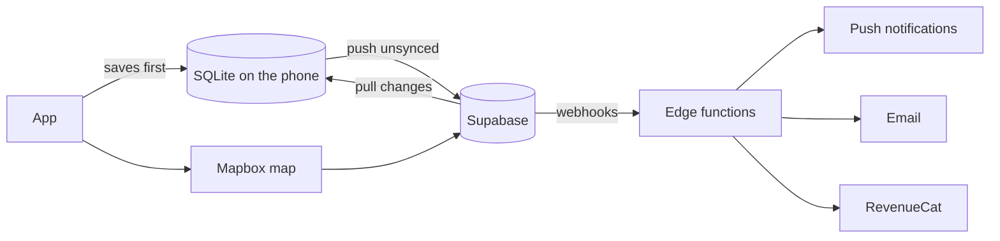

# Talus

A bouldering log app for climbing outdoors and in the gym. It's live on the [App Store](https://apps.apple.com/app/id6779186802), and there's a site at [taluslog.com](https://taluslog.com).

It's a live app, so the code is private. This repo is a write-up of what it does and how I built it.

  
  
  

## Why

At the crag you've usually got cold hands and no signal, so Talus is built to let you log a session in a few taps with no connection. It syncs when you're back online.

## What it does

- Log sends and attempts per grade, split by wall angle, with more detail per climb if you want it.
- Stats: grade pyramid, send rate, volume, top grade, training load and a grade forecast.
- A coach that gives you something to focus on each week and a session plan with actual grades and numbers.
- A map of 10,000+ crags, boulders and gyms, from OpenStreetMap plus spots people have added, with photos, ratings, beta videos and offline maps.
- Share a session with whoever you climbed with, and it goes into their log too.
- Import from theCrag or Mountain Project, and export to CSV or JSON.

## The coach

There's no AI in it. It's all rules and stats in TypeScript, because if it tells you overhangs are your weakness, you should be able to trust that.

Some of how it works:

- Send rate is worked out as a range rather than a single number, because of how failed attempts get logged. When it compares two things, say slab and overhang, it only says there's a difference if the ranges don't overlap. If there isn't much data yet, it doesn't say anything.
- Each week it picks one thing to focus on, in a fixed order: rest, ease back in, weak angle, weak hold type, consolidate, push a grade, consistency, maintain. That way you don't get mixed messages.
- The gap between your max grade and your flash grade is compared with published norms from around 88,000 climbers.

I got some of this wrong the first time. The training load maths told anyone who climbs occasionally to rest forever, and the grade forecast was really measuring how much people logged rather than how hard they climbed. I rewrote both, and the coaching logic now has about 225 tests.

## How it's built

- Everything saves to SQLite on the phone first. When the app opens with a connection, it pushes anything unsynced to Supabase and pulls whatever's changed since the last sync. Cloud data never overwrites something you've changed locally that hasn't synced yet.
- Photos have their location data stripped before they upload.
- Before each release there's a check that the production database matches what the app expects, because one unexpected column would stop sync for everyone.
- Spots from OpenStreetMap only get imported if they have real climbing info on them, like a grade or a route count. Otherwise the map fills up with junk.

233 commits, 38 screens, 46 migrations and 5 edge functions. iOS is live and Android is in progress.

## Stack

React Native, Expo, Expo Router, TypeScript, SQLite, Supabase (Postgres, Auth, Storage, Edge Functions), Mapbox, RevenueCat, PostHog, Resend, EAS, Vitest
